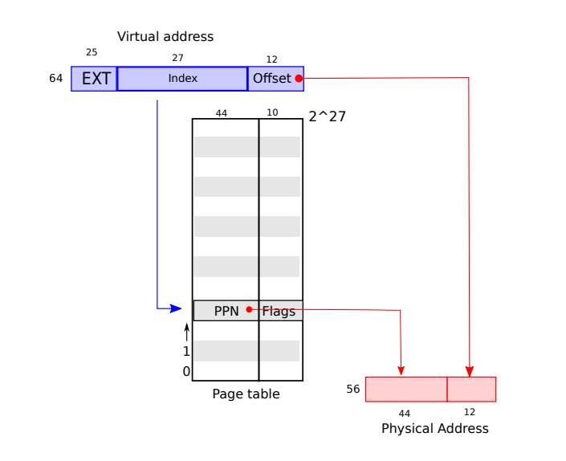
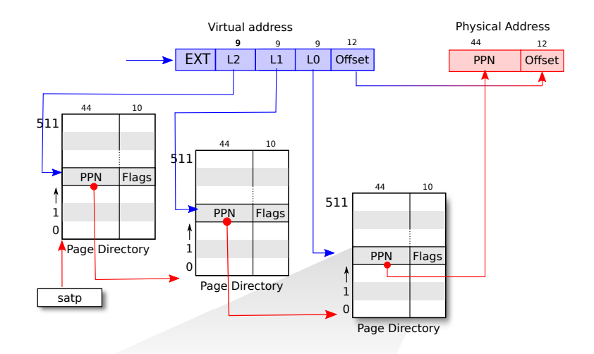

页表（page table）是用来干什么的？  
地址翻译，va->pa。页表的一边是虚拟地址，另一边是物理地址，CPU将va传给MMU，MMU通过查询页表得到pa，实现地址翻译。页表是一个数组，索引表示虚拟地址，数组的值表示物理地址。  

MMU要用页表，页表存储在什么地方呢？  
内存中，只需要告诉MMU页表的内存地址。这个地址是物理地址还是虚拟地址呢？  
物理地址，我们不能让地址翻译依赖于另一个翻译，否则可能会陷入递归的无限循环中。。。

页表为每一个虚拟地址存储一个物理地址？  
字节是最小寻址单元，为每一字节需要8个字节存储物理地址（考虑64位地址），内存可能还不够存页表。。。  

怎么解决页表占用内存过大呢？  
1. 不要为每个地址创建一个表单条目，而是为每个page创建一条表单条目
2. 多级页表

为每个page创建一条表单条目，怎么实现字节粒度的地址翻译呢？  

假设一个page的大小为4KB，对于虚拟地址，将它划分为两部分，index和offset，index用来查找page，offset对应的是一个page中的哪个字节。  
当MMU在做地址翻译的时候，通过读取虚拟内存地址中的index可以知道物理内存中的page号，这个page号对应了物理内存中的4096个字节。之后虚拟内存地址中的offset指向了page中的4096个字节中的某一个，假设offset是12，那么page中的第12个字节被使用了。将offset加上page的起始地址，就可以得到物理内存地址。  

以上图为例，每个页表仍然需要2^27个条目，每个条目占8个字节，每个页表占内存1GB，而且每个进程都会有一个页表，这仍然是不能接受的。

到目前位置，最大的问题是即使应用程序所引用的只是虚拟地址空间中很小的一部分，也总是需要一个完整的页表驻留在内存中。  
有没有什么办法能对页表进行“动态分配”呢？  
多级页表   

以[xv6](https://pdos.csail.mit.edu/6.S081/2020/xv6.html)使用的RISC-V处理器为例，使用3级页表。先来看看它是怎么完成地址翻译的。  
我们之前提到的虚拟内存地址中的27bit的index，实际上是由3个9bit的数字组成（L2，L1，L0）。前9个bit被用来索引最高级的page directory，一个directory是4096Bytes，就跟page的大小是一样的。Directory中的一个条目被称为PTE（Page Table Entry）是64bits，所以一个Directory page有512个条目。我们用虚拟内存中index的高9bit用来索引最高一级的page directory，这样我们就能得到一个PPN，也就是物理page号。这个PPN指向了中间级的page directory。当我们在使用中间级的page directory时，我们通过虚拟内存地址中的L1部分完成索引。接下来会走到最低级的page directory，我们通过虚拟内存地址中的L0部分完成索引。在最低级的page directory中，我们可以得到对应于虚拟内存地址的物理内存地址。

为什么多级页表可以节省内存呢？  
举个例子，如果你的地址空间只使用了一个page，4096Bytes。除此之外，你没有使用任何其他的地址。现在，你需要多少个page table entry，或者page table directory来映射这一个page？
在最高级，你需要一个page directory。在这个page directory中，你需要一个数字是0的PTE，指向中间级page directory。所以在中间级，你也需要一个page directory，里面也是一个数字0的PTE，指向最低级page directory。所以这里总共需要3个page directory（也就是3 * 512个条目）。  
而在前一个方案中，虽然我们只使用了一个page，还是需要2^27个PTE。这个方案中，我们只需要3 * 512个PTE。所需的空间大大减少了。  

为什么上图中是PPN存储在Page Directory中？而不是一个虚拟地址？  
我们不能让地址翻译依赖于另一个翻译，否则可能会陷入递归的无限循环中。。。

多级页表是操作系统实现的还是由硬件自己实现的？  
这是由硬件实现的，所以多级page table的查找都发生在硬件中。MMU是硬件的一部分而不是操作系统的一部分。

参考  
https://www.youtube.com/watch?v=f1Hpjty3TT8  
https://pdos.csail.mit.edu/6.S081/2020/xv6/book-riscv-rev1.pdf  
https://mit-public-courses-cn-translatio.gitbook.io/mit6-s081/lec04-page-tables-frans/4.3-ye-biao-page-table